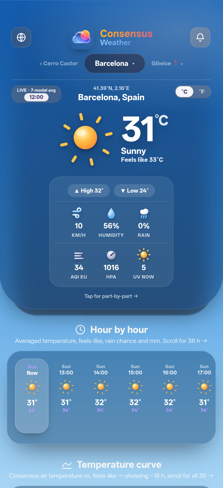
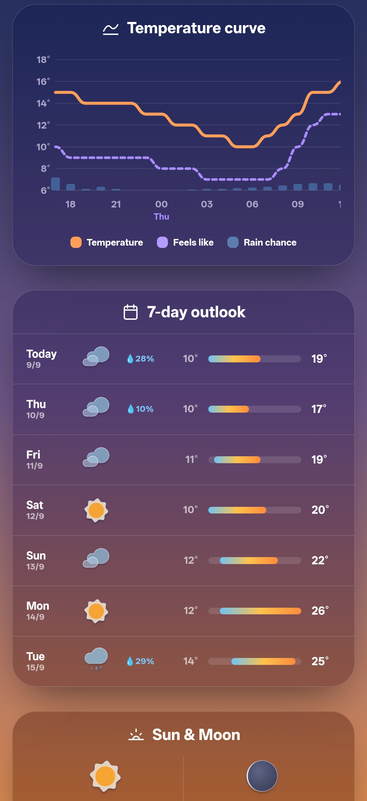
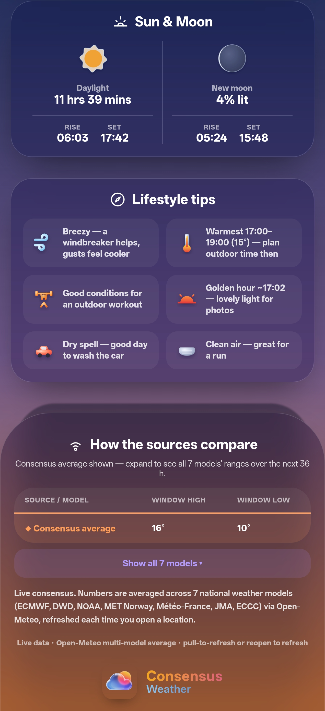
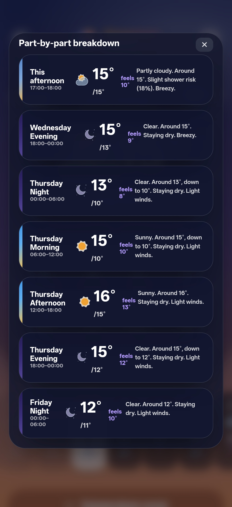
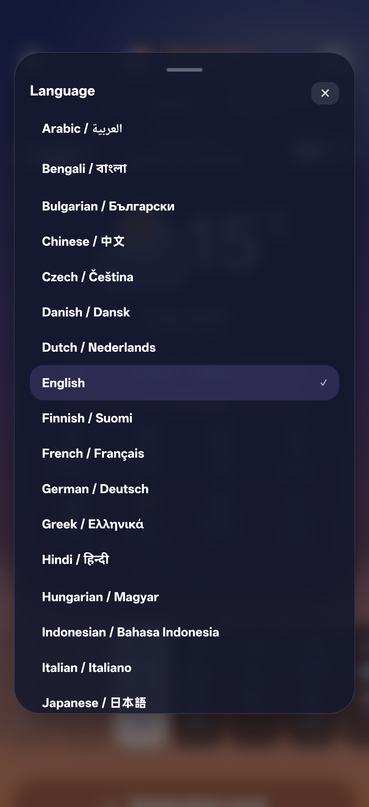

# Consensus Weather
<p align="center">
  
</p>

A playful weather app that shows a 36-hour forecast, a part-by-part day/night breakdown, and a 7-day outlook for any city you add. Every number is a live average of 7 national weather models — ECMWF, DWD ICON, NOAA GFS, MET Norway (Yr), Météo-France, JMA and ECCC GEM — fetched from the free [Open-Meteo](https://open-meteo.com) API (no API key, no account). It also shows sun/moon rise & set with the current moon phase, a live pollen count, air quality, and lifestyle tips (including a biometeorological well-being read-out).

The background is a living sky that shifts with the time of day and conditions, with hand-rolled animated weather effects layered on top — falling rain, drifting snow, lightning flashes, fog banks and blowing dust — all drawn on a canvas, so nothing is loaded from the network. Gliwice ships as an offline fallback so the app shows something even with no connection.

The app is a self-contained web app. It runs two ways from the same file:
- wrapped in a native Android **WebView** and installed as a normal **APK**, and
- as a **home-screen web app** on iPhone/Android via a hosted link (GitHub Pages).

You never need Android Studio, Gradle, or a Mac/PC toolchain — **GitHub builds the APK for you in the cloud.**

## Screenshots

<table>
  <tr>
    <td align="center"><br><sub>Live 7-model hero & Houerly breakdown</sub></td>
    <td align="center"><br><sub>Temperature curve & 7-day outlook</sub></td>
    <td align="center"><br><sub>Sun/Moon & Lifestyle Tips</sub></td>
    <td align="center"><br><sub>Part-by-Part Pop-Up Breakdown</sub></td>
    <td align="center"><br><sub>Language Selector (33 languages to choose from)</sub></td>
  </tr>
</table>

---

## Download & install (Android)

Grab the latest APK from either:
- **Actions** tab → the most recent green run → **Artifacts** → `ConsensusWeather-debug-apk`, or
- the **Releases** page (right sidebar) → latest release → `app-debug.apk`.

Then on the phone:
- Download `app-debug.apk` (open the page in the phone's browser, or transfer the file over).
- Tap it. OS will ask to **allow installing unknown apps** from that source — enable it, then tap **Install**.
- Open **Consensus Weather** from your app drawer.

It's a debug-signed APK, which is fine for installing on your own phone (it just can't be published to the Play Store as-is).

## Install on Android

- Download `app-debug.apk` to the phone (open the Actions/Releases page in the phone's browser, or transfer the file).
- Tap the file. OS will ask to **allow installing unknown apps** from that source — enable it, then tap **Install**.
- Open **Consensus Weather** from your app drawer.

It's a debug-signed APK, which is fine for installing on your own phone (it just can't be published to the Play Store as-is).

## Install on iPhone (or any phone, via the web link)

iOS can't install APKs, but the same app runs as a full-screen home-screen app:

- Open the hosted link in **Safari**: `https://szebastian31.github.io/Consensus_Weather/`
- Tap **Share** → **Add to Home Screen** → **Add**.
- It launches full-screen with the app icon, and updates whenever you push to the `docs/` folder.

---

## Using the app

- Top bar: a ☰ menu (top-left), the app logo in the centre, and a time pill (top-right) that shows the last-refresh time on top and the viewed location’s live local time below it.

- ☰ Menu opens a side drawer with Language (33 languages), Notifications, and the °C / °F temperature-unit toggle. The “LIVE · 7-model avg” status and refresh time sit pinned at the bottom of the drawer.

- Location selector: a centered pill under the logo shows the city you’re viewing. Tap it to open the manage popup, where you can search and add any city (up to 10), remove saved cities, or use your current GPS location. Your current-location entry can’t be removed.

- With more than one city saved, faint previews of the previous/next city sit on either side of the pill — tap them to jump, or swipe left/right anywhere on the screen to switch cities.

- 📍 My location: on first launch the app asks for location permission and sets the view to your GPS location automatically (falling back to Gliwice if you decline or it’s unavailable).

- Tap the main weather card for the part-by-part day/night breakdown popup.

- Refresh: tap the logo, or pull down at the top. The app also auto-refreshes every 15 minutes while it’s open in the foreground.

- Your saved cities and last-viewed city persist on the device.


### When it fetches data (and when it doesn't)

Data is fetched from Open-Meteo at these moments:

- when you open the app (and when you bring it back to the foreground),

- when you add, switch, or GPS-locate a city,

- when you tap the logo or pull down to refresh, and

- automatically every 15 minutes while the app stays open in the foreground (it pauses while the app is hidden, so it never polls in the background).

Adding a city or using GPS needs an internet connection. Everything is served over HTTPS with no API key. Location permission is optional — the app works fully without it; you just won’t have the 📍 shortcut.


## Rebuilding after edits

Change anything (e.g. `app/src/main/assets/index.html` to tweak the UI), commit, and GitHub rebuilds a new APK automatically. Bump `versionCode`/`versionName` in `app/build.gradle` if you want Android to treat it as an update. For the web/iPhone version, update the copy in `docs/` too.

## Project layout

```
Consensus_Weather/

├─ app/

│  ├─ build.gradle

│  └─ src/main/

│     ├─ AndroidManifest.xml

│     ├─ assets/index.html            ← the whole weather app (UI + live data)

│     ├─ java/com/consensus/weather/MainActivity.java

│     └─ res/…                        ← icon, theme, strings

├─ docs/                              ← web/home-screen version (GitHub Pages)

│  ├─ index.html

│  └─ emblem.png

├─ .github/workflows/build.yml        ← cloud APK build

├─ build.gradle · settings.gradle · gradle.properties
```

## Notes & tech choices

- **minSdk 24 / targetSdk 34**, Java 17, AGP 8.5.2, Gradle 8.7 — a stable, proven combo.
- No third-party libraries: pure framework `WebView` + `Activity`, so builds are fast and rarely break.
- The chart, all weather icons, sun/moon calculations (a trimmed SunCalc), and the animated weather effects (a small canvas particle engine) are all hand-rolled — no external chart library, animation library, or CDN — so the UI renders even offline. The effects respect the system reduced-motion setting and pause when the app is hidden.
- Condition coverage includes clear, partly cloudy, cloudy, overcast, fog, rain (incl. heavy rain & showers), drizzle, sleet/freezing rain, snow (incl. showers), thunderstorms, hail, and sandstorm/dust, each with its own icon and sky.
- Live data & city search require internet; the bundled Gliwice snapshot covers the no-connection case.

## Data sources & attribution

- Weather, air quality & pollen: [Open-Meteo](https://open-meteo.com) — free, keyless, and licensed under CC-BY 4.0. Forecasts are a live average of ECMWF, DWD ICON, NOAA GFS, MET Norway, Météo-France, JMA and ECCC GEM.

- Reverse geocoding (GPS → city name): [BigDataCloud](https://www.bigdatacloud.com).

- City search: the Open-Meteo Geocoding API.

Weather data by Open-Meteo.com (CC-BY 4.0). Please keep this attribution if you reuse the app.

## License

Released under the MIT License ↗ (LICENSE).

<p align="center">
  
</p>
